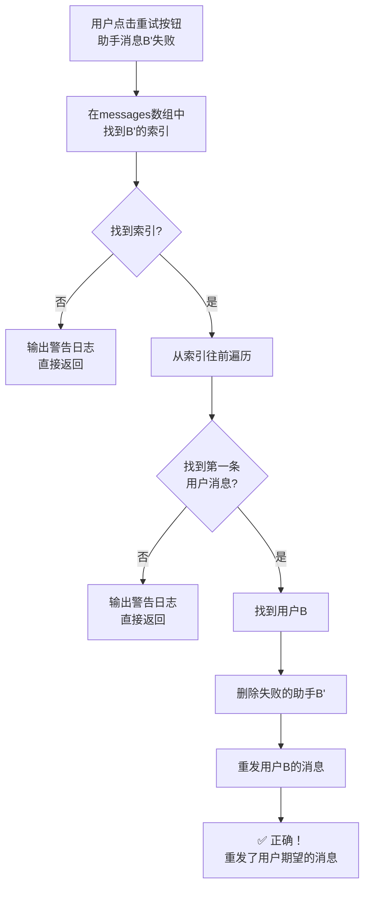
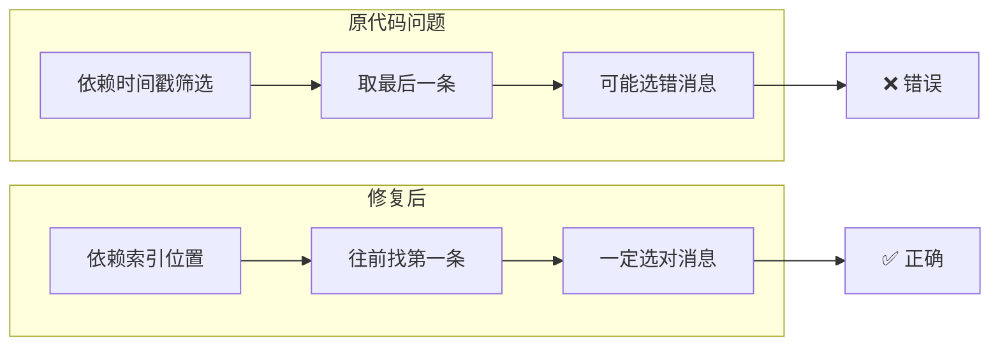
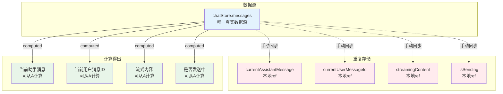
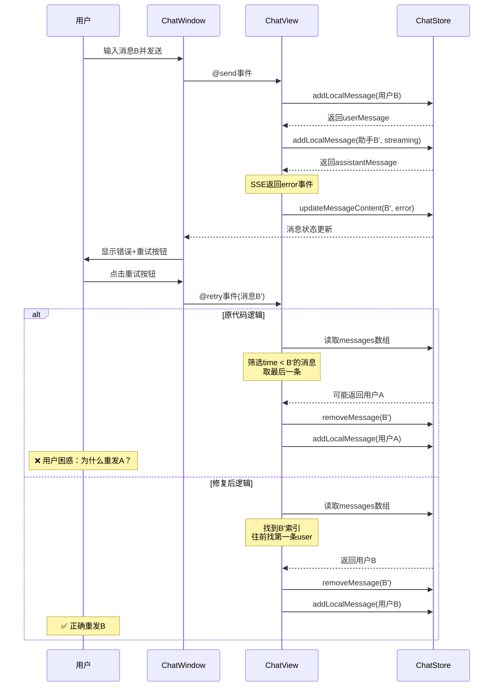

# 消息重发逻辑流程图

> **状态：已修复** | 相关 Issue 已关闭
>
> 本文档记录了消息重发问题的分析和修复过程。

## 1. 原代码的问题流程

```mermaid
flowchart TD
    A[用户点击重试按钮<br/>助手消息B'失败] --> B{查找对应的<br/>用户消息}
    
    B --> C[使用 chatStore.messages<br/>原始数组]
    C --> D[筛选所有 time < B' 的用户消息]
    D --> E[得到: [用户A, 用户B]]
    E --> F[取最后一条: 用户B]
    
    B --> G[用户看到的是<br/>chatStore.sortedMessages]
    G --> H[按时间排序后:<br/>[用户A, 助手A', 用户B, 助手B']]
    H --> I[用户认为B'前面是B]
    
    F --> J{messages数组<br/>实际顺序}
    J --> K[可能是:<br/>[用户B, 用户A, 助手A', 助手B']]
    K --> L[筛选出 [用户B, 用户A]]
    L --> M[取最后一条 = 用户A]
    
    M --> N[❌ 错误！<br/>重发了用户A的消息]
    I --> O[用户期望重发B]
    
    N --> P[用户困惑:<br/>"为什么重发的不是B?"]
    O --> P
```

## 2. 修复后的正确流程



## 3. 核心问题对比



## 4. 状态重复问题示意图



## 5. 完整的消息发送与重试流程


