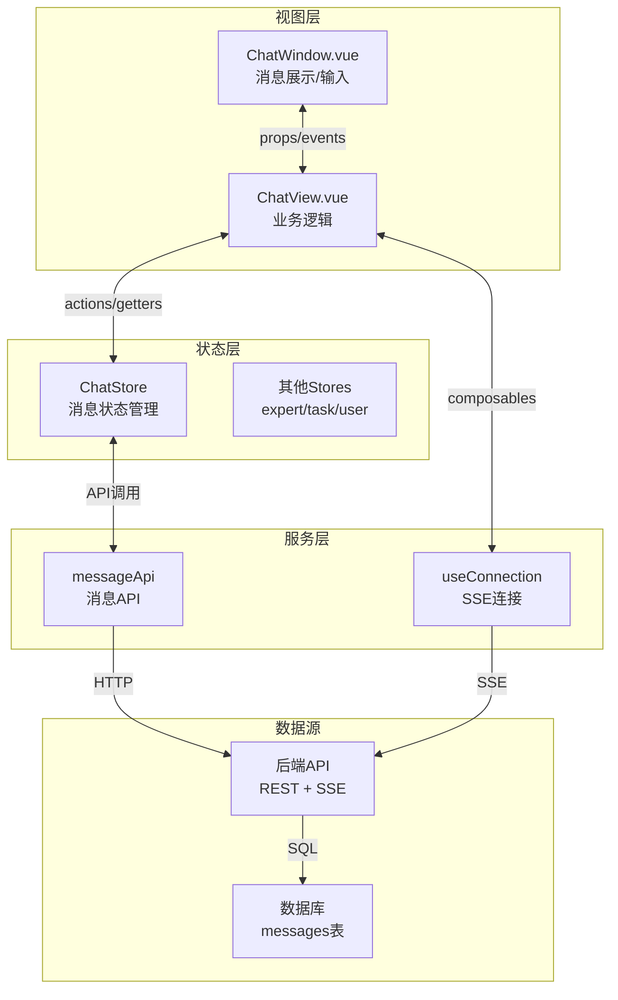
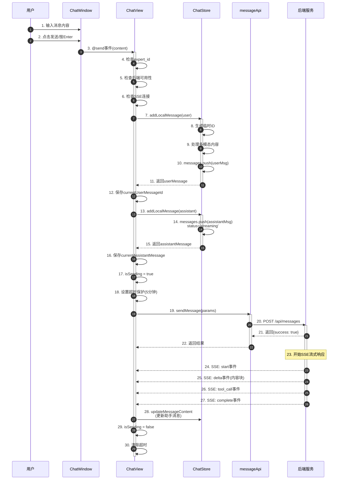
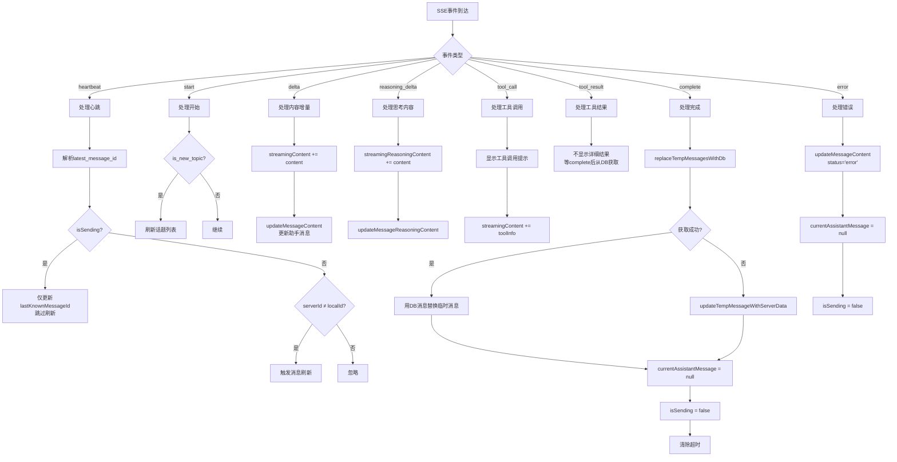
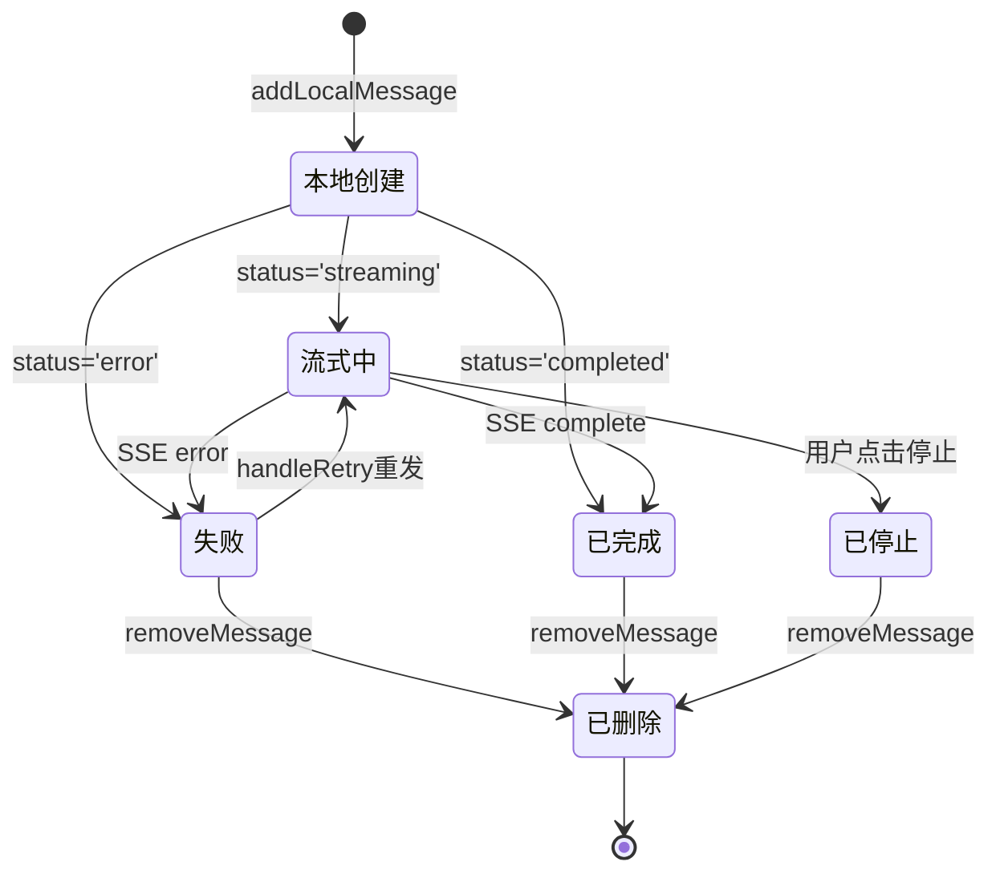
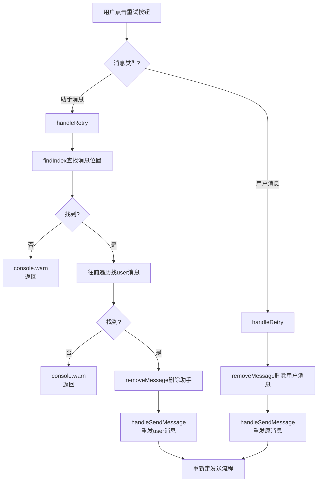
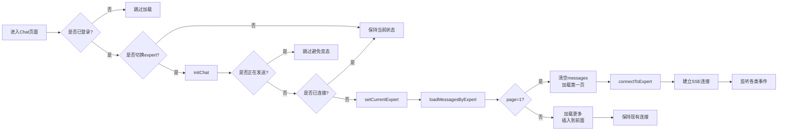
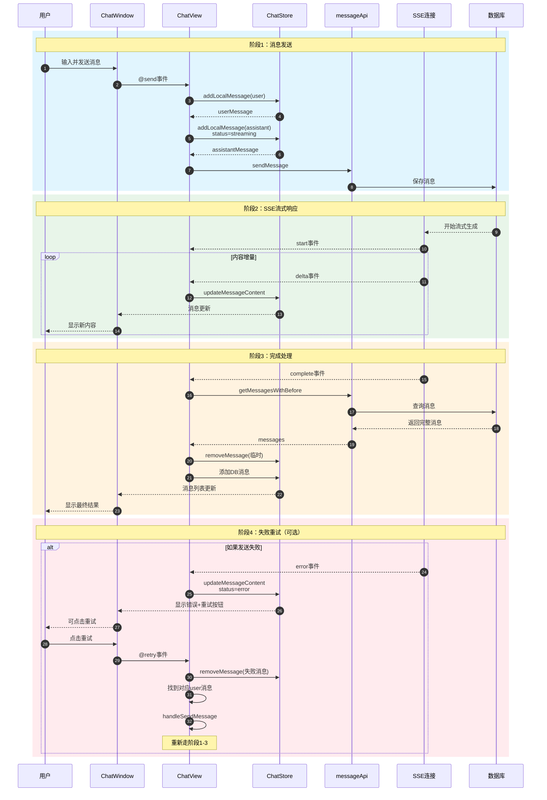
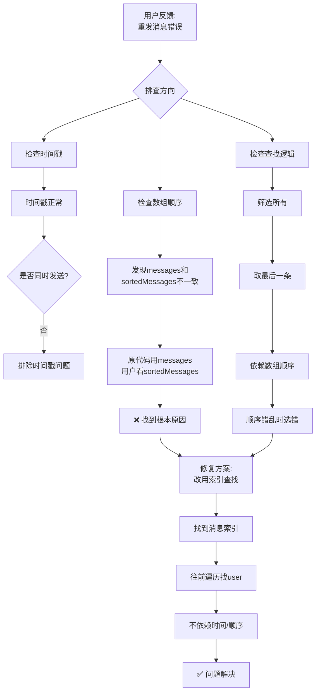
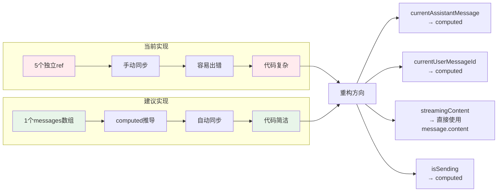

# ChatView 消息处理完整流程图

## 1. 整体架构图



## 2. 消息发送完整流程



## 3. SSE 事件处理流程



## 4. 消息状态流转图



## 5. 消息重试流程（修复后）



## 6. 消息加载流程



## 7. 状态变量关系图

```mermaid
flowchart TB
    subgraph 真实数据源
    A[chatStore.messages<br/>Message[]]
    end

    subgraph 派生状态
    B[sortedMessages<br/>computed排序]
    C[hasMoreMessages<br/>computed判断]
    end

    subgraph 本地重复存储
    D[currentAssistantMessage<br/>ref<Message>]
    E[currentUserMessageId<br/>ref<string>]
    F[streamingContent<br/>ref<string>]
    G[streamingReasoningContent<br/>ref<string>]
    H[isSending<br/>ref<boolean>]
    end

    subgraph 可从A计算得出
    I[当前助手消息<br/>find streaming]
    J[当前用户消息<br/>往前找user]
    K[流式内容<br/>assistant.content]
    L[是否发送中<br/>some streaming]
    end

    A --> B
    A --> C

    A -.->|手动同步| D
    A -.->|手动同步| E
    A -.->|手动同步| F
    A -.->|手动同步| G
    A -.->|手动同步| H

    A -->|computed| I
    A -->|computed| J
    A -->|computed| K
    A -->|computed| L

    style A fill:#e3f2fd,stroke:#1976d2,stroke-width:2px
    style D fill:#ffebee
    style E fill:#ffebee
    style F fill:#ffebee
    style G fill:#ffebee
    style H fill:#ffebee
    style I fill:#e8f5e9
    style J fill:#e8f5e9
    style K fill:#e8f5e9
    style L fill:#e8f5e9
```

## 8. 时序图：完整的消息生命周期



## 9. 问题定位图



## 10. 优化建议图


