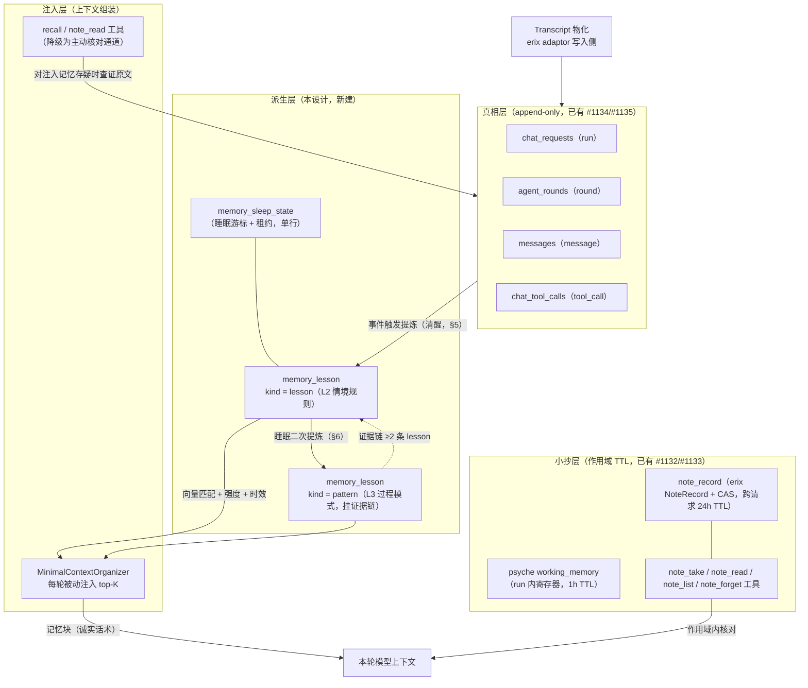
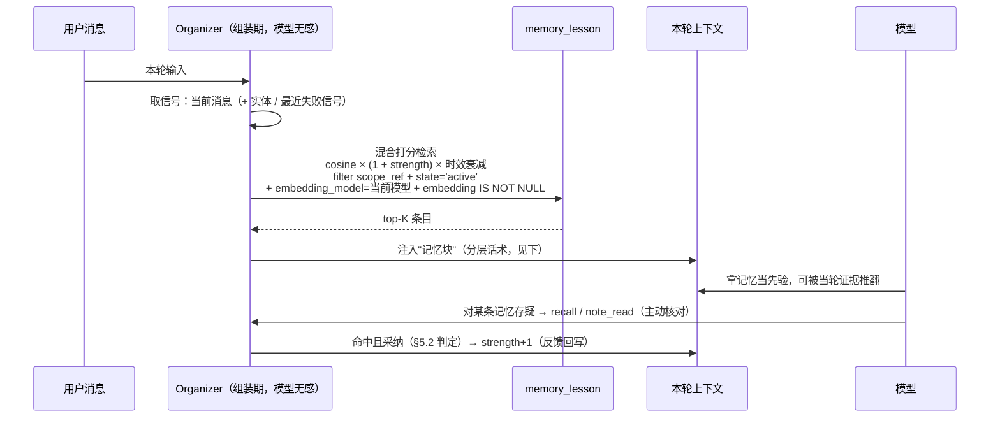
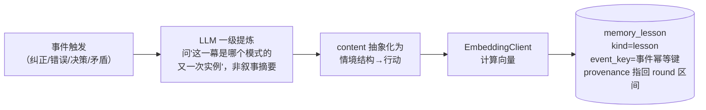
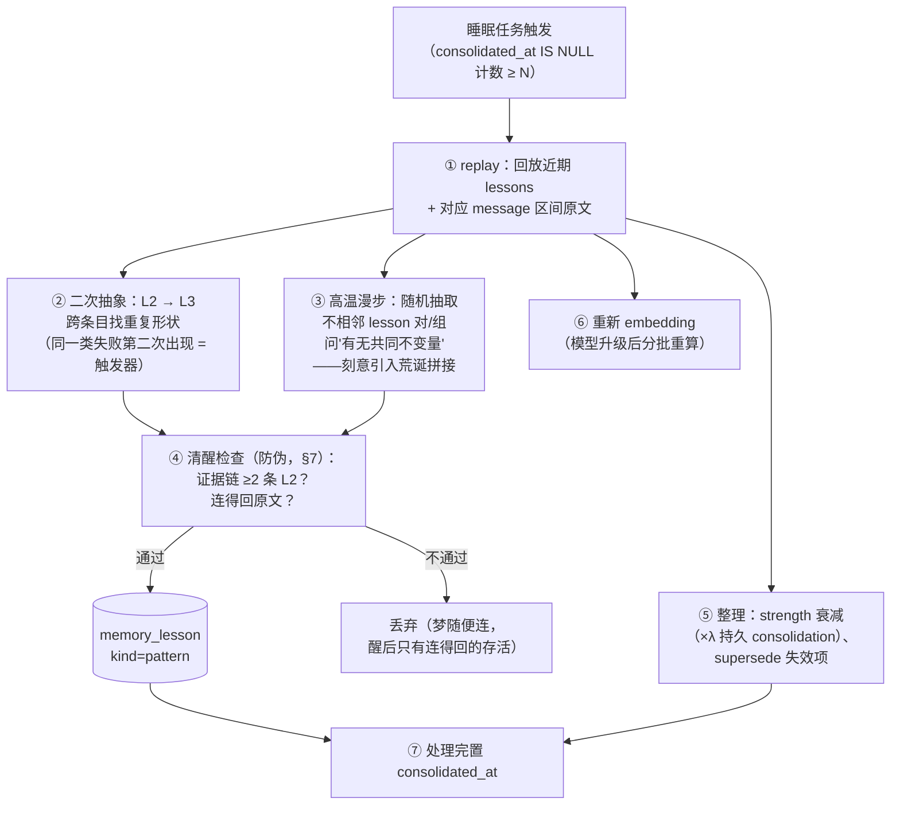
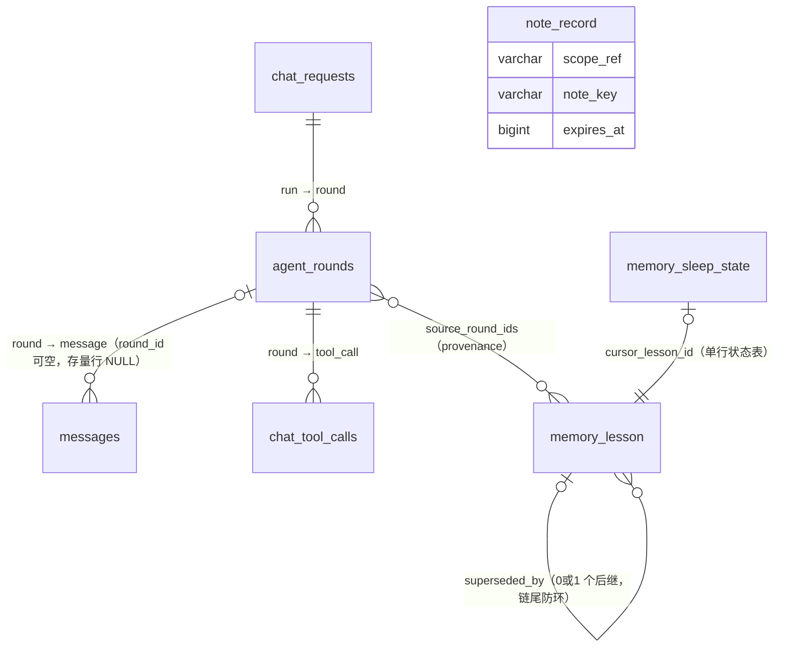

# Touwaka 记忆系统设计（Memory Model）

> **⚠️ 实施口径（2026-10-04 起）：本文件是远期记忆层地图，当前不排期。**
> 近期主线是 [topic-episode-plan.md](./topic-episode-plan.md)（topic 情节化改造）。
> 本文件的 lesson / pattern / 睡眠层由该计划的基线数据触发（挣得条件见 §12）。
>
> **状态：设计稿 v3（2026-10-04 讨论定稿；经两轮独立评审修订，未实现）。**
> v2 修订：strength 评分先验（冷启动自锁）、睡眠任务契约、小抄层两层作用域、
> scope 校验、embedding 空值防护、#1123 逐项去向。
> v3 修订：幂等/游标的 Schema 落点（event_key / content_hash / consolidated_at
> / memory_sleep_state）、事件信号与采纳信号检测机制、时效衰减函数定义与
> 双衰减论证、§10 去向表降级为如实状态、引用消歧与时间字段表述修正、
> supersede 链防护、注入检索缓存策略、待定参数清单。
> 来源：issue #1123（notes/psyche 记忆层治理）的延伸讨论。#1123 原文把
> 小抄（Notes）当成了记忆来要求，方向有误；经重新划分职责后，Notes 侧
> 只收窄为两条结论，真正的记忆系统在本设计中独立成文。

---

## 1. 设计哲学：每层的契约由它对"丢失"的态度定义

| 层 | 是什么 | 对丢失的态度 | 正确性要求 |
|---|---|---|---|
| **真相层**（messages / rounds） | 发生过什么的完整记录 | **不允许丢**（append-only，删除只由保留期/隐私政策触发） | 可回放、可审计 |
| **派生层**（lesson / pattern，本设计） | 对 messages 的再整理 + lessons learned | 可容忍，但**可重建**（从真相层重新推导） | 可溯源、可证伪 |
| **小抄层·run 内**（psyche working_memory） | 当前 run 的活状态（寄存器/栈帧） | 1h TTL 内存/Redis，重启即失 | 不许有东西"依赖"它活着；关键值须显式晋升到 notes |
| **小抄层·跨请求**（notes，`note_record`） | user+expert 作用域的工作记忆（已有 #1132/#1133） | 作用域内可丢；TTL 硬删是小抄语义的一部分（见下） | 同上；作用域由 `user_id + expert_id` 稳定派生 |
| **注入层**（上下文组装） | 这轮给模型看什么 | **不删存储，只做选择** | top-K 淘汰，未入选 ≠ 不存在 |

一句话：**transcript 管发生过的，lesson 管学到的，note 管正在算的，注入层管这轮看什么。**

小抄有界是它语义的一部分（永生的小抄才是 bug——无限增长、旧值冒充权威值）。
小抄层的自然寿命是**作用域**：psyche 的作用域是单个 run，notes 的作用域是
`(user_id, expert_id)` 的工作集（跨请求稳定复用，见
`docs/development/notes-governance.md`）。两层的 TTL 语义须如实区分：

- **psyche（run 内寄存器）**：作用域有自然终点（run 结束），TTL 应绑定
  run 存活——现状按墙钟 1h 走是作用域与钟点的错位（见 §10 结论 1）；
- **notes（跨请求工作集）**：作用域**没有自然终点**，TTL 硬删实际是唯一
  淘汰机制。这是**设计决策**而非妥协：notes 是小抄，"过期即失效"符合其
  契约——但必须配套"系统不许承诺它还在"（§10 结论 2）。

两者的价值梯度正是晋升路径：**run 内关键值（一次性计算结果等）应从 psyche
显式晋升到 notes**，而不是让易挥发层承担超出其作用域的可靠性。记忆则完全
相反：它是真相层的派生视图，丢了可以重建，但重建有代价——所以它值得一张
自己的表。

## 2. 认知分层：存储形态决定模式匹配的上限

| 层 | 人的能力 | 存储形态 | 匹配发生在什么上 | touwaka 对应物 |
|---|---|---|---|---|
| L0 观察陈述 | "一根笔直的树枝" | 原文/叙事摘要 | 字面词、表面话题 | topic summary（现状，退出检索链路） |
| L1 事件事实 | "上周他说过 X" | 结构化事件 + provenance | 实体、时间 | `messages` / `agent_rounds`（已有） |
| L2 情境规则 | "这种场合该这么做" | `当<情境结构>→<行动>`，剥离领域 | **情境的结构形状** | `memory_lesson`（kind=lesson） |
| L3 过程模式 | 家族兴衰史、"事情总这样演化" | 跨条目的重复形状，须挂证据链 | **时间轴上的形状** | `memory_lesson`（kind=pattern） |
| L4 纯抽象结构 | 拉马努金式同构 | 不刻意存储，只能涌现 | 高维结构同构 | 超出工程范围（见 §6 防伪） |

关键点：

- **topic 是时间容器，记忆是跨容器的内容**——按容器组织记忆，检索时就要求
  "先猜对是哪个容器"，这在 touwaka 的无限对话（无 session 边界）里必然失败。
  这是既有 topic 提炼效果不好的根因，不是摘要质量的问题。
- **Topic 保留为浏览用的 UI 组织单位（给人看的），彻底退出记忆的检索链路。**
- L2 教训必须**抽象化存储**（"当用户要求 X 时先确认 Y"，而非字面对话原文）：
  匹配发生在抽象层而非字面层，向量才能跨领域命中——"通感"的工程形态。

## 3. 架构总图



## 4. 读取与注入：被动联想，工具只管核对

**核心论断：记忆必须被"推"进上下文，不能被"拉"。** LLM 不愿意调工具读记忆
不是习惯问题，是逻辑上不可能——调用记忆工具的前提是"知道自己不知道"，而
遗忘恰恰意味着不知道自己不知道。人类回忆也不是查询，是被动联想：思考进行到
某处，相关的东西自己浮上来。



注入话术按认知分层标注置信度（**注入诚实**）：

| kind | 话术 |
|---|---|
| lesson | "过去学到，可能过时，可被当轮证据推翻" |
| pattern | "观察到重复出现的形状" |

工具（`recall` / `note_read`）从此只承担**核对**职责：模型对注入的记忆起疑、
或要引用原文时主动查——验证用，不用于发现。

**评分公式**：`score = cosine × (1 + strength) × decay(t)`，其中

- `(1 + strength)`：新 lesson（strength=0）仍以纯 cosine 相关性参与召回，
  冷启动不依赖历史强度；
- **时效衰减 `decay(t) = 0.5 ^ (Δt / half_life)`**：Δt = now −
  `last_recalled_at`（从未被命中则用 `created_at`），`half_life` 默认
  30 天（待定参数，见 §11）。它是**查询期因子，不落库**，表达"近期有用性"。
- 与睡眠任务 strength ×λ 衰减（§6⑤）的分工，避免双重惩罚：时效衰减度量
  **"最近有没有被用到"**（recency of usefulness，逐轮变化、不持久化）；
  strength ×λ 度量 **"积累的确认是否可信"**（consolidation，睡眠期持久化）。
  一个"旧但反复被确认"的条目：strength 高、时效衰减低——它确实最近没被
  用到，压低是正确行为；一个"新但从未被确认"的条目：时效高、strength 低——
  以纯相关性参与，靠命中与否决定去留。两个因子作用于不同的轴，不构成对
  同一信号的重复惩罚。

注入时**必须**同时按 `scope_ref` 过滤（跨租户隔离，见 §7 规则 5；
scope_ref 由 `buildNotesScopeRef(user_id, expert_id)` 同源派生）。

## 5. 写入路径：清醒（事件触发的一级提炼）

提炼**不做定时摘要**，只由语义事件触发（无 session 边界，边界不能当触发器）：

| 触发事件 | 说明 | 优先级 |
|---|---|---|
| 用户明确纠正（"不是这样，应该……"） | 直接 contradicts 已注入/已说的内容 | **最高**（负教训价值最高） |
| 模型犯错后修正 | 如 erix-agent#58 类"编造一次性值"事故 → 凝成"该场景必须 note_read 核对，禁止凭记忆重算" | **最高** |
| 显式决策 / 偏好表达 | "以后都用 X" | 中 |
| 与旧 lesson 矛盾的新事实 | 触发 supersede 而非新增 | 中 |



### 5.1 事件信号检测机制（写入路径的开工前提）

| 信号 | 检测方式 | 成本 |
|---|---|---|
| 模型犯错后修正 | **纯规则**：`chat_tool_calls.is_error` 为真且同 name 工具随后重试成功（已有索引 `idx_chat_tool_calls_is_error`） | 零 LLM 成本 |
| 用户明确纠正 | **候选词粗筛 + LLM 确认**：用户消息命中纠正类关键词（"不对/不是这样/应该…"，i18n 词表）→ 进入候选池 | 粗筛零成本 |
| 决策/偏好表达 | 同上，候选词粗筛（"以后/记住/默认都…"） | 粗筛零成本 |
| 候选确认 + 提炼 | **一次轻量 LLM 调用**：输入最近 N 轮 messages（含注入命中记录），输出结构化 JSON `{is_event, kind, lesson_candidate, supersedes?}` | 仅候选触发，非每轮 |

- 确认调用挂 **run 收尾阶段**（`lib/chat-service.js` 收尾 hook）与错误恢复点，
  使用既有 reflective 通道；**模型配置必须走 `modelRegistry` /
  `db.getModelConfig()`**（AGENTS §2.6 红线，禁止读 `ai_model` 裸数据）。
- 候选词粗筛是召回率优先的 cheap filter：漏检可接受（睡眠 replay 兜底），
  误检由确认调用过滤。

### 5.2 "命中且采纳"判定信号（反馈回写的开工前提）

注入的记忆块内条目带可引用标记（`[lsn_xxx]`）。采纳信号按强度分级：

1. **显式引用**：模型回答/后续工具调用中显式使用了记忆条目内容 → strength+1
   （**v1 只实现这一档**，宁缺勿滥，符合 §7 防伪哲学）；
2. **收尾判定**（v2 预留）：run 收尾确认调用顺带判定"本轮是否依赖了注入
   记忆"，命中 → +1；
3. **违反**：用户/后续事实推翻某条记忆 → 触发 supersede 评估（§7 规则 1②）。

一级提炼**允许粗糙**：海马体的快速索引本来就不精确，精确性由"睡眠"慢慢磨
（§6）。请求路径上追求一次提炼到位，是让海马体干皮层的活。

**embedding 空值与异常策略**：`EmbeddingClient.embed()` 有两条失败路径——
返回 `null`（abort/未配置）与 **throw**（上游非 abort 错误，见
`lib/embedding-client.js`）。落库策略：embed 调用必须 try/catch 包裹，
null/异常时记录照常落库（`embedding` 为 NULL），不参与向量检索，由睡眠任务
补算；**throw 不阻断提炼主流程**。检索时**必须**排除
`embedding_model` ≠ 当前活跃模型或 `embedding IS NULL` 的行——不同模型/
维度的向量混算无意义。当前活跃模型的获取走 `modelRegistry`（同 §5.1 红线）。

## 6. 整理路径：睡眠（后台 replay + 重新抽象 + 高温漫步）

人需要大量离线时间做重新整理与重新抽象（梦境 = 海马体离线回放 + 生成模型
带扰动重建）。工程对应：**提炼不在请求路径，记忆系统需要"睡眠"**——挂在
既有 `lib/background-scheduler.js`。触发条件不是"对话结束了"（没有边界），
而是"积累够 N 条未整理 lesson"（`consolidated_at IS NULL` 计数，见 §8）。



**噪声是特性不是缺陷**：高温漫步是模拟退火——跳出局部最优要先容忍高温乱走；
"通感"是撞出来的，不是查出来的。但产出必须过清醒检查（证据链）才能存活。

### 睡眠任务契约（幂等 / 断点 / 隔离）

既有 `background-scheduler` 的 `preventOverlap` 是**单进程内**去重，超时用
`Promise.race` 实现（不能取消原任务）。睡眠任务因此必须自带以下契约：

1. **事件幂等（Schema 落点）**：事件触发提炼带 `event_key`
   （`事件类型 + 触发消息/round id`），`memory_lesson.event_key` 唯一键
   兜底重试不重复入库；近重复内容由 `content_hash` 索引支持合并判定
   （同 scope 存在同 hash 且 `state='active'` → 合并/跳过，见 §8）。
2. **持久游标（不得用 `updated_at`）**：strength 反馈回写与衰减都会改写
   `updated_at`，用它当游标会让已处理条目反复回到"未整理"窗口。游标语义
   由 `consolidated_at IS NULL`（待处理队列）+ `memory_sleep_state`
   单行表的 `cursor_lesson_id`（replay 推进断点）共同承担，失败后从断点
   重跑，不做全表扫描。
3. **多实例租约（落点）**：租约记录在 `memory_sleep_state` 单行表
   （`lease_owner` / `lease_until`），到期可抢；不能依赖进程内状态。
4. **分批可恢复**：全量重嵌入按批推进、逐批更新 `memory_sleep_state`，
   新旧 `embedding_model` 并存期间靠 §4/§5 的模型过滤避免混算。
5. **超时语义**：`Promise.race` 超时后原任务可能仍在跑，重跑前必须能通过
   `event_key`/`consolidated_at` 识别已完成部分。

## 7. 防伪机制（抽象层级越高，越需要）

过度抽象的模式会什么都匹配（"万金油教训"污染所有注入）。规则：

1. **strength 只由三种事件改写**：① 注入命中且被采纳（§5.2 判定，+1）；
   ② 被违反/被纠正（触发 supersede 评估）；③ 睡眠任务按**固定衰减规则**
   （每周期 ×λ，下限 0）。除此之外任何任务/路径不得改写 strength（定时
   摘要、管理操作等无事件依据的随意改写一律禁止）。
2. **L3 pattern 必须挂证据链**：`evidence_lesson_ids` ≥ 2 条 L2 教训的 id，
   像论文引用；睡眠整理时发现证据链断裂（证据被 supersede）→ pattern
   级联降级/退役，且注入检索必须排除已失效 pattern。
3. **supersede 而非删除**：教训会过时（"用户喜欢简洁"三个月后可能反转）。
   走 `state='superseded'` + `superseded_by` 链——全系统统一采用
   **"supersede 优先"**的版本化原则（notes 的 `note_forget` 除外，其语义
   即显式撤销，物理删除是该语义的实现，不算例外破坏）。
   **链防护**：写入 supersede 时沿 `superseded_by` 走到链尾再指向（防环）；
   链长超过上限（默认 8，待定参数）时由睡眠任务把链尾改写为直接指向最新
   active 条目（压平链）；检索只取 `state='active'`，链中节点状态由睡眠
   任务负责收敛一致。
4. **注入预算硬上限**：记忆块 token 预算固定，top-K 之外不塞（无损淘汰，
   未入选 ≠ 删除）。
5. **scope 一致性强制校验（跨租户隔离）**：隔离是**一等列**——
   `memory_lesson.scope_ref` 与记录同源派生并落列，检索 WHERE 必带
   `scope_ref`（DB 层兜底，不依赖应用层自觉）；`source_round_ids` 指向的
   `agent_rounds` 经 `request_id` 关联 `chat_requests` 校验归属，
   提炼、检索、回放、反馈回写全程校验 round 归属与 scope 一致，不一致的
   provenance 拒绝写入/注入。

## 8. 落地表：`memory_lesson` + `memory_sleep_state`

新表，进 `scripts/upgrade-database.js` 增量迁移；模型生成走 sequelize-auto
（`models/` 禁手改）。遵循项目约定：主键字符串 `lsn_` 前缀（ID 约定见
**全局** `~/projects/AGENTS.md` §3.4——注意与本项目 `touwaka/AGENTS.md`
§3.4（PR 规范）消歧——及 `docs/design/data-model.md`「ID 前缀登记」）；
时间字段采用应用侧写入的 **BIGINT 毫秒时间戳**，与 `note_record` 一线对齐
（真相层 `agent_rounds`/`chat_tool_calls` 用 DATETIME，两种惯例并存，本表
选 BIGINT 以保持 ms 语义与 `last_recalled_at`/`expires_at` 一致）；布尔不用
TINYINT。

```sql
CREATE TABLE IF NOT EXISTS memory_lesson (
  id                  VARCHAR(32)  NOT NULL COMMENT 'lsn_ + Utils.newID(20)',
  user_id             VARCHAR(32)  NOT NULL,
  expert_id           VARCHAR(32)  NOT NULL,
  scope_ref           VARCHAR(128) NOT NULL COMMENT 'buildNotesScopeRef(user_id, expert_id) 同源派生，隔离一等列',
  kind                VARCHAR(16)  NOT NULL COMMENT 'lesson | pattern',
  content             TEXT         NOT NULL COMMENT '抽象化不变量："当<情境>→<行动>"',
  content_hash        CHAR(64)     NOT NULL COMMENT 'sha256(user_id\0expert_id\0normalize(content))，近重复检测',
  event_key           VARCHAR(255) NULL     COMMENT '事件幂等键：事件类型+触发消息/round id；NULL 可重复',
  embedding           JSON         NULL     COMMENT '向量（JSON 数组），应用侧 cosine；lesson 与 pattern 均须有值才参与注入',
  embedding_model     VARCHAR(128) NULL     COMMENT '生成向量所用模型（升级后可辨识重算）',
  source_round_ids    JSON         NOT NULL COMMENT 'provenance：agent_rounds.id 列表，可回放可重建',
  evidence_lesson_ids JSON         NULL     COMMENT 'pattern 的证据链（lesson id，≥2）',
  strength            INT          NOT NULL DEFAULT 0 COMMENT '仅由命中采纳/违反/睡眠衰减改写',
  state               VARCHAR(16)  NOT NULL DEFAULT 'active' COMMENT 'active | superseded',
  superseded_by       VARCHAR(32)  NULL COMMENT '取代本条的 lesson id（写入时走链尾防环）',
  last_recalled_at    BIGINT       NULL COMMENT '最近一次注入命中（ms，应用侧写入；时效衰减的 Δt 基准）',
  consolidated_at     BIGINT       NULL COMMENT '睡眠任务处理标记；NULL=未整理（睡眠队列）',
  created_at          BIGINT       NOT NULL,
  updated_at          BIGINT       NOT NULL,
  PRIMARY KEY (id),
  UNIQUE KEY uk_lesson_event (event_key),
  KEY idx_lesson_scope (scope_ref, kind, state),
  KEY idx_lesson_hash (scope_ref, content_hash),
  KEY idx_lesson_consolidated (consolidated_at),
  KEY idx_lesson_updated (updated_at)
) ENGINE=InnoDB DEFAULT CHARSET=utf8mb4 COLLATE=utf8mb4_unicode_ci;

CREATE TABLE IF NOT EXISTS memory_sleep_state (
  id                VARCHAR(32)  NOT NULL COMMENT '固定单行 ''sleep_global''',
  cursor_lesson_id  VARCHAR(32)  NULL COMMENT 'replay 推进断点（memory_lesson.id）',
  lease_owner       VARCHAR(64)  NULL COMMENT '当前持锁实例标识',
  lease_until       BIGINT       NULL COMMENT '租约到期（ms），到期可抢',
  last_run_at       BIGINT       NULL COMMENT '上次睡眠完成时间（ms）',
  updated_at        BIGINT       NOT NULL,
  PRIMARY KEY (id)
) ENGINE=InnoDB DEFAULT CHARSET=utf8mb4 COLLATE=utf8mb4_unicode_ci;
```

设计取舍：

- **一张表两个 kind**（`lesson`/`pattern`），不拆两张表：L2/L3 是同一提炼
  管线的两个深度，共享 supersede/注入路径；`kind` 只是分层话术与防伪规则
  的开关。**pattern 同样计算 embedding**（检索统一走向量通道，embedding
  NULL 的条目一律不注入）。
- **幂等双键**：`event_key` 唯一键承担"同一事件重试不重复入库"（对标
  `agent_rounds.dedup_key` 惯例；NULL 可重复，MariaDB 唯一索引对 NULL
  放行）；`content_hash` 为**非唯一**索引——同 hash 且 `state='active'`
  的近重复由写入侧合并/跳过。不做全状态唯一：同内容教训被 supersede 后
  因新事件重新学得是**合法事件**，全列唯一会挡住它。
- **`consolidated_at` 独立于 `updated_at`**：反馈回写（strength+1）与衰减
  只改 `updated_at`/`strength`，不触碰 `consolidated_at`——睡眠队列
  （`consolidated_at IS NULL`）不会被高频反馈踩成永久非空；游标断点存
  `memory_sleep_state.cursor_lesson_id`，不用 id 序（id 虽按 §3.4 约定
  字典序递增，游标仍显式落库以免依赖实现细节）。
- **embedding 存 JSON + 应用侧 cosine**：规模假设为**单 `scope_ref` 作用域
  数千条量级**；注入在每轮请求路径执行，因此：① 进程内 LRU 缓存整个
  scope 的向量集（数千条 × 1536 维 float32 ≈ 数 MB），以 `embedding_model`
  变化与睡眠整理为失效事件；② 每轮仅对当前用户消息做一次增量 embed。
  超出规模阈值（大客户/全局知识记忆）再评估向量库。`embedding_model` 落列
  + §4 的模型过滤用于换模型后识别重算范围（睡眠任务 ⑥）并防止混算。
- **provenance 用 round id 列表**：与真相层 `agent_rounds` 直接对齐，任意
  lesson 可回放到原始对话（可重建性的锚点）。
- **没有 topic_id 外键**：topic 退出检索链路（§2），不进记忆的键。

表间关系：



> 注：`memory_lesson` 的两条自关联基数不同——evidence 链要求 pattern 至少
> 挂 2 条 lesson（应用层校验，DB 不加外键）；superseded_by 为可选后继。

## 9. 实现落点

| 组件 | 位置 | 状态 |
|---|---|---|
| 真相层写入 | erix adaptor 写入侧（`lib/llm-kit-adapters/`） | ✅ 已有（#1134/#1135） |
| 小抄层 | `lib/notes/`（policy / store / adapter / facade）+ erix 原生 note_* | ✅ 已有（#1132/#1133） |
| `memory_lesson` + `memory_sleep_state` 表 + store | `scripts/upgrade-database.js` 增量 + `lib/memory-lesson/`（新，raw SQL 经 `lib/db.js`，参照 `lib/notes/db-note-record-store.js` 模式） | ❌ 待实现 |
| 事件信号检测 + 事件触发提炼器 | §5.1 机制；挂 `lib/chat-service.js` 收尾 hook 与错误恢复点；LLM 配置走 `modelRegistry` | ❌ 待实现 |
| 睡眠整理任务 | 挂 `lib/background-scheduler.js`（replay / 二次抽象 / 高温漫步 / 衰减 / 重嵌入），租约/游标落 `memory_sleep_state` | ❌ 待实现 |
| 被动注入 + 向量缓存 | `lib/context-organizer/minimal-organizer.js`（记忆块组装 + 预算上限 + LRU 向量集） | ❌ 待实现 |
| recall 核对通道改造 | `recall` 现为 Topic/消息列表+搜索（`lib/tool-manager.js`），转核对通道需支持按 `round_id`/`message_id` 查原文 | ❌ 待实现 |
| 反馈回写 | §5.2 显式引用判定 → strength+1；违反 → supersede 评估（v1 只做显式引用档） | ❌ 待实现 |
| 评测 | 提炼质量 + 注入命中率评测（可借 erix-llm-kit 记忆评测夹具） | ❌ 待实现 |

## 10. 与 issue #1123 的关系

#1123 原文的各项建议逐条标注**如实状态**（✅ 已落地 / ◐ 部分落地 /
➡ 待承接 / ✖ 决策性拒绝）。#1123 当前 OPEN；**处理建议：按本表拆出子
issue（psyche TTL 绑 run、prompt 文案修正、记忆实现），子 issue 建完后
关闭 #1123**——表内仍有待承接项，不建议直接关闭。

| #1123 原始建议 | 状态 | 说明 |
|---|---|---|
| ① 去 TTL 化（notes 落 DB、touch 只供排序） | ◐ | 已落地：MariaDB 持久化（#1132）+ read/list 不续期。**未落地且被决策性拒绝**："TTL 仅作软信号不做删除"——notes 是小抄，TTL 硬删是其语义的一部分（§1）；收窄为"作用域 TTL + 卫生上限"（本节结论 1） |
| ② 注入层淘汰，不删记录 | ✅ | `PsycheManager.compress` 只裁剪注入集合，底层记录不删；记忆侧由本设计 §1/§4 承接 |
| ③ `calculated_values` pin | ➡ | **待承接**：psyche TTL 绑定 run 存活，或关键值显式晋升 notes（本节结论 1） |
| ④ 引用完整性 | ◐ | 已落地：CAS + 冲突显式报错。**未落地**：注入侧对不可读引用的降级（refs 指向已过期笔记时降级为"未记录"而非悬空）——并入本节结论 2 一并修 |
| ⑤ 来源标注 | ◐ | 已落地：`provenance: {source, verified, ts}` + `superseded` 历史。**缺**：#1123 要求的 `round/toolUseId` 维度，随记忆实现（`source_round_ids`）补齐 |
| ⑥ 显式 forget | ✅ | erix 原生 `note_forget`，adapter 层物理删除语义 |
| 记忆治理（TTL 软信号化、注入层选择等"记忆"部分） | ➡ | 迁出至本设计，实现另开 issue |

**Notes 收窄为两条结论**（#1123 剩余有效部分）：

1. **过期单位 = 作用域 + 卫生上限**：psyche 的作用域是单个 run，现状 TTL
   3600 按"墙钟"走，25h 长任务会在 run 存活时丢工作记忆——需把 psyche TTL
   绑定 run 存活（或 `calculated_values` 显式晋升 notes，对应上表 ③）。
   notes 的 `(user_id, expert_id)` 作用域无自然终点，TTL 硬删即其淘汰机制，
   属设计决策而非缺陷（§1）。
2. **prompt 诚实**：小抄允许消失，但系统不许承诺它还在。既有待修项：
   `minimal-organizer.js` 441-443 行注入文案同时过时——①"Notes 可能不跨
   服务重启保留"与 MariaDB 化现状不符；②"长期记忆依靠 Topic 归档与 recall"
   与本设计 Topic 退出检索链路的决策冲突。两处应随本设计落地一并修正。

## 11. 待定参数清单（实现前需拍板，先给推荐值）

| 参数 | 含义 | 推荐初值 |
|---|---|---|
| `N` | 睡眠触发阈值（`consolidated_at IS NULL` 计数） | 20 |
| `λ` | 睡眠期 strength 衰减系数（每周期 ×λ，下限 0） | 0.9 |
| `half_life` | 时效衰减半衰期（§4） | 30 天 |
| `K` | 注入 top-K 条数 | 5 |
| `TOKEN_BUDGET` | 记忆块 token 预算上限 | 1500 |
| `SUPERSede_CHAIN_MAX` | supersede 链长上限（超过压平） | 8 |
| `LRU_SIZE` | 向量集缓存条目上限（每 scope） | 5000 |

## 12. 实施顺序与挣得条件（重要）

本设计的各层**不按设计完整度推进，按上一层的实测失败推进**。经第三轮独立
代码验证（2026-10-04）后确定的顺序：

| 顺序 | 内容 | 触发条件（挣得条件） |
|---|---|---|
| 当前主线 | [topic 情节化改造](./topic-episode-plan.md)（含基线测量、归档器补全、split、修订历史） | **已触发**：topic 提炼效果有用户实测反馈 |
| 不排期 | 本文件的 lesson 层（事件触发提炼 + `memory_lesson`） | topic 基线显示**原文/摘要检索仍不足**（语义召回缺口） |
| 不排期 | 本文件的 pattern 层（二次抽象 + 证据链） | lesson 层上线后，同类失败**第二次被观测到** |
| 不排期 | 睡眠任务的“高温漫步” | pattern 层产出率被证实偏低，需引入探索（实验开关，不进主干） |
| 已否决 | `message_embedding`（对 messages 逐条向量化） | —（粒度错配：噪声、与活跃窗口冗余、热路径成本；见 topic 计划 §5） |
| 已否决 | 单用户 LoRA / activation steering / KV 注入 | —（不可解释、无 provenance、锁模型版本；与溯源可证伪哲学正交） |

**纪律**：任何一层在没有对应实测数据前不启动；启动时先建评测基线。

---

*最后更新: 2026-10-04（设计稿 v3 + 实施口径修订，源自 #1123 延伸讨论 + 两轮独立评审 + 一次代码验证，未实现）*
