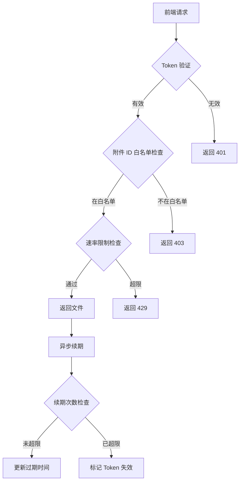
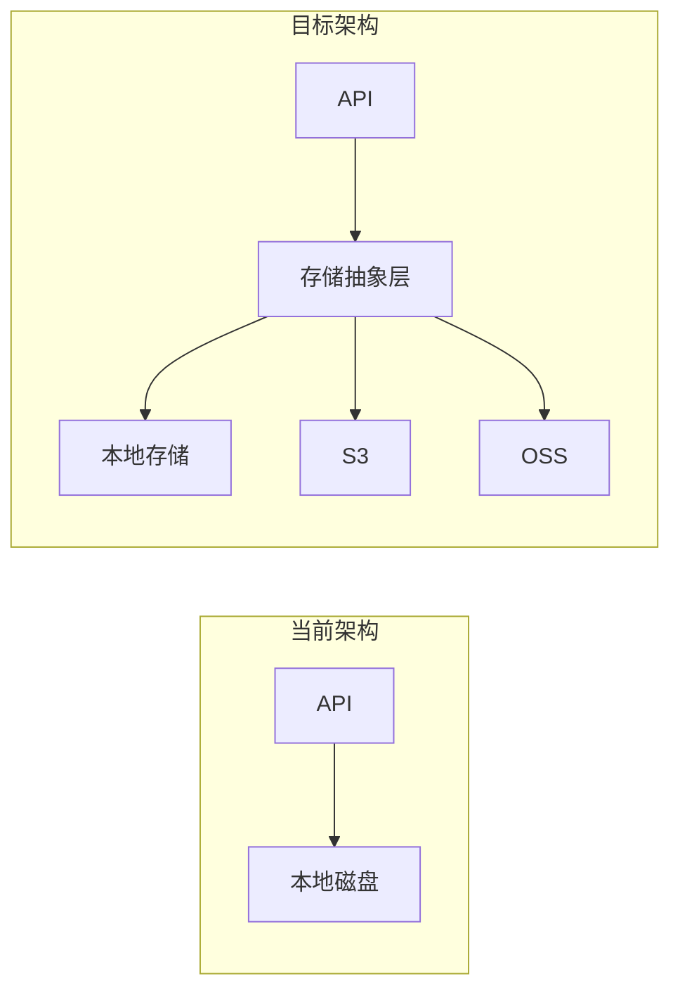
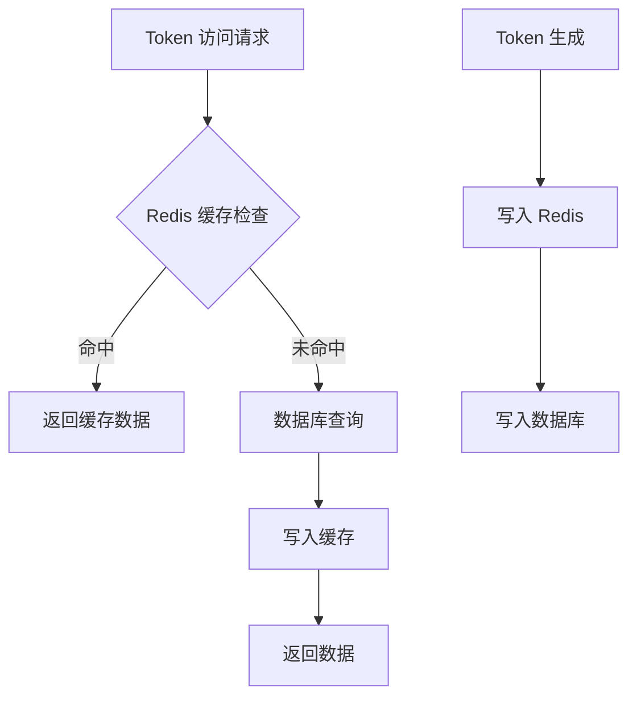

# 附件服务架构审视报告

> **审视日期**: 2026-04-06  
> **审视范围**: 附件服务设计文档 v1.3  
> **审视维度**: 安全性、性能、可扩展性、可靠性、可维护性

---

## 执行摘要

本报告对附件服务设计方案进行了全面的架构审视，共发现 **15 个问题**，其中：
- 🔴 严重问题：3 个
- 🟠 中等问题：7 个
- 🟡 轻微问题：5 个

主要风险集中在 **Token 安全模型**、**并发性能** 和 **数据一致性** 三个领域。

---

## 1. 安全性分析

### 🔴 1.1 Token 泄露风险 - 资源级 Token 权限过度

**问题描述**：
资源级 Token 设计允许一个 Token 访问某资源的 **所有附件**。一旦 Token 泄露，攻击者可以访问该资源下的所有文件。

**风险场景**：
```
用户 A 获取 Token 访问文章 X 的图片
Token URL: /attach/t/abc123xyz/att_001

攻击者获取该 Token 后：
/attach/t/abc123xyz/att_002  ← 可访问同一文章的其他图片
/attach/t/abc123xyz/att_003  ← 甚至可能访问敏感导出文件
```

**问题根源**：
- Token 绑定 `source_tag + source_id`，而非具体附件
- 同一 `source_id` 下的所有附件共享同一 Token
- 缺少 Token 使用次数限制

**改进建议**：
1. **短期方案**：添加 Token 可访问附件 ID 白名单
   ```sql
   ALTER TABLE attachment_token ADD COLUMN allowed_ids TEXT COMMENT 'JSON数组，允许访问的附件ID列表';
   ```

2. **中期方案**：实现 Token 使用审计日志
   ```sql
   CREATE TABLE attachment_access_log (
     id BIGINT PRIMARY KEY AUTO_INCREMENT,
     token_id INT NOT NULL,
     attachment_id VARCHAR(20) NOT NULL,
     ip_address VARCHAR(45),
     user_agent VARCHAR(500),
     accessed_at DATETIME DEFAULT CURRENT_TIMESTAMP,
     INDEX idx_token_time (token_id, accessed_at)
   );
   ```

3. **长期方案**：考虑一次性 Token 或短期 Token（5-15分钟）

---

### 🔴 1.2 Token 续期机制存在滥用风险

**问题描述**：
滑动过期策略（每次访问续期 1 小时，最大 24 小时）可能导致 Token 长期有效。

**风险场景**：
```
T0: 用户获取 Token，expires_at = T0 + 1h
T0 + 30min: 用户访问图片，Token 续期，expires_at = T0 + 1.5h
T0 + 1h: 用户再次访问，Token 续期，expires_at = T0 + 2h
...持续循环...
理论上 Token 可通过持续访问无限续期（受 24h 上限约束）
```

**问题根源**：
- 续期策略过于宽松
- 缺少续期次数限制
- 缺少异常访问检测

**改进建议**：
1. 添加续期次数限制：
   ```sql
   ALTER TABLE attachment_token ADD COLUMN renew_count INT DEFAULT 0;
   ALTER TABLE attachment_token ADD COLUMN max_renew_count INT DEFAULT 10;
   ```

2. 实现续期冷却期：距离上次续期至少 5 分钟

3. 添加异常检测：同一 Token 短时间内大量访问触发告警

---

### 🟠 1.3 权限检查实现不完整

**问题描述**：
[`checkAttachmentPermission`](docs/design/attachment-service-design.md:398) 函数使用 switch-case 分发权限检查，但缺少默认拒绝策略的详细定义。

**代码问题**：
```javascript
default:
  // 未知类型默认拒绝
  return false;
```

**潜在风险**：
- 新增 `source_tag` 时可能忘记添加权限检查
- 权限检查逻辑分散在多个模块
- 缺少权限检查的单元测试覆盖

**改进建议**：
1. 使用策略模式重构权限检查：
   ```javascript
   const permissionCheckers = {
     'kb_article_image': checkKbArticlePermission,
     'kb_article_cover': checkKbArticlePermission,
     'user_avatar': () => true,  // 公开
     'expert_avatar': () => true,  // 公开
     'task_export': checkTaskPermission,
   };
   
   async function checkAttachmentPermission(ctx, attachment) {
     const checker = permissionCheckers[attachment.source_tag];
     if (!checker) {
       logger.warn(`Unknown source_tag: ${attachment.source_tag}`);
       return false;
     }
     return checker(ctx.user, attachment.source_id);
   }
   ```

2. 添加权限检查注册机制，新业务模块自行注册

3. 强制要求每个 `source_tag` 必须有对应的权限检查器

---

### 🟠 1.4 MIME 类型验证不足

**问题描述**：
MIME 类型白名单仅在上传时验证，但文件内容未做实际校验。

**风险场景**：
```
攻击者上传恶意文件：
{
  "mime_type": "image/png",  // 声称是 PNG
  "base64_data": "<script>alert('XSS')</script>"  // 实际是 HTML
}

后续访问时：
Content-Type: image/png  ← 响应头声称是 PNG
但浏览器可能根据内容嗅探执行脚本
```

**改进建议**：
1. 上传时验证文件魔数（Magic Number）：
   ```javascript
   const FILE_SIGNATURES = {
     'image/png': [0x89, 0x50, 0x4E, 0x47],
     'image/jpeg': [0xFF, 0xD8, 0xFF],
     'image/gif': [0x47, 0x49, 0x46, 0x38],
   };
   ```

2. 响应时强制 `Content-Disposition: attachment` 对非图片类型

3. 添加 `X-Content-Type-Options: nosniff` 响应头

---

### 🟡 1.5 缺少速率限制

**问题描述**：
Token 生成 API 和附件访问 API 缺少速率限制，可能被滥用。

**风险场景**：
- 攻击者暴力枚举 Token（虽然 64 位随机字符难以枚举）
- 攻击者通过大量请求消耗服务器资源
- 恶意用户大量上传文件消耗存储空间

**改进建议**：
1. Token 生成 API 添加速率限制：每用户每分钟最多 10 次
2. 附件访问 API 添加速率限制：每 Token 每分钟最多 100 次
3. 上传 API 添加配额限制：每用户每天最多 100MB

---

## 2. 性能分析

### 🔴 2.1 Token 访问路由存在 N+1 查询问题

**问题描述**：
[`GET /attach/t/:token/:attachment_id`](docs/design/attachment-service-design.md:347) 每次访问需要执行多次数据库查询。

**当前流程**：
```sql
-- 1. 查询 Token
SELECT * FROM attachment_token WHERE token = ?;

-- 2. 检查过期
-- (应用层判断)

-- 3. 查询附件
SELECT * FROM attachments WHERE id = ?;

-- 4. 验证 source 匹配
-- (应用层判断)

-- 5. 更新 Token（续期）
UPDATE attachment_token SET expires_at = ?, last_access_at = ? WHERE id = ?;
```

**问题分析**：
- 每次图片访问触发 2 SELECT + 1 UPDATE
- 高并发场景下数据库压力大
- 续期操作可能成为瓶颈

**改进建议**：
1. **短期方案**：合并查询
   ```sql
   SELECT at.*, a.* 
   FROM attachment_token at
   JOIN attachments a ON a.source_tag = at.source_tag AND a.source_id = at.source_id
   WHERE at.token = ? AND a.id = ? AND at.expires_at > NOW();
   ```

2. **中期方案**：引入 Redis 缓存
   ```javascript
   // Token 缓存
   const tokenCacheKey = `attach:token:${token}`;
   const cachedToken = await redis.get(tokenCacheKey);
   
   // 附件元信息缓存
   const attachCacheKey = `attach:meta:${attachmentId}`;
   const cachedMeta = await redis.get(attachCacheKey);
   ```

3. **长期方案**：异步续期
   - 续期操作放入消息队列
   - 主流程仅做读取和验证

---

### 🟠 2.2 附件列表查询缺少分页

**问题描述**：
[`GET /api/attachments?source_tag=xxx&source_id=xxx`](docs/design/attachment-service-design.md:219) 返回某资源的所有附件，缺少分页机制。

**风险场景**：
```
某文章包含 1000 张图片：
GET /api/attachments?source_tag=kb_article_image&source_id=article_123

响应体可能达到数 MB，包含 1000 个附件的元信息
```

**改进建议**：
1. 添加分页参数：
   ```
   GET /api/attachments?source_tag=xxx&source_id=xxx&page=1&page_size=50
   ```

2. 添加总数限制：单资源最多 500 个附件

3. 考虑懒加载：前端滚动时按需加载

---

### 🟠 2.3 Base64 上传导致内存压力

**问题描述**：
上传 API 使用 Base64 编码，导致：
- 内存占用翻倍（Base64 比二进制大约 33%）
- 大文件上传时 Node.js 内存压力大
- 缺少流式处理

**改进建议**：
1. 支持 `multipart/form-data` 上传：
   ```javascript
   // 使用 multer 中间件
   const upload = multer({ 
     storage: multer.diskStorage({...}),
     limits: { fileSize: 10 * 1024 * 1024 }
   });
   router.post('/attachments', upload.single('file'), handler);
   ```

2. 保留 Base64 上传作为备选（兼容现有客户端）

3. 添加流式处理支持大文件

---

### 🟠 2.4 缺少文件去重机制

**问题描述**：
相同文件多次上传会创建多个副本，浪费存储空间。

**风险场景**：
```
用户 A 上传 logo.png (1MB)
用户 B 上传相同的 logo.png (1MB)
用户 C 上传相同的 logo.png (1MB)

存储空间：3MB
理想情况：1MB（去重后）
```

**改进建议**：
1. 计算文件哈希（SHA-256）
2. 添加 `file_hash` 字段：
   ```sql
   ALTER TABLE attachments ADD COLUMN file_hash VARCHAR(64) COMMENT 'SHA-256哈希';
   CREATE INDEX idx_file_hash ON attachments(file_hash);
   ```

3. 上传时检查哈希是否已存在，存在则复用

---

### 🟡 2.5 磁盘存储缺少清理机制

**问题描述**：
附件删除后磁盘文件未清理，可能导致存储泄漏。

**风险场景**：
```
1. 用户上传图片，磁盘创建文件
2. 数据库事务回滚，记录未创建
3. 磁盘文件成为孤儿文件
```

**改进建议**：
1. 实现定时清理任务：扫描孤儿文件
2. 使用事务确保数据一致性
3. 添加软删除机制，延迟清理

---

## 3. 可扩展性分析

### 🟠 3.1 source_tag 扩展机制不完善

**问题描述**：
新增 `source_tag` 需要修改多处代码：
- 数据库注释
- 权限检查函数
- API 文档
- 前端代码

**改进建议**：
1. 创建 `source_tag` 注册表：
   ```sql
   CREATE TABLE attachment_source_types (
     source_tag VARCHAR(50) PRIMARY KEY,
     description VARCHAR(255),
     permission_checker VARCHAR(100) COMMENT '权限检查器名称',
     created_at DATETIME DEFAULT CURRENT_TIMESTAMP
   );
   ```

2. 实现动态权限检查器注册

3. 提供管理 API 查询支持的 `source_tag`

---

### 🟠 3.2 存储后端扩展性受限

**问题描述**：
当前设计仅支持本地磁盘存储，难以扩展到对象存储（S3、OSS 等）。

**改进建议**：
1. 抽象存储接口：
   ```javascript
   interface StorageProvider {
     save(key: string, data: Buffer): Promise<string>;
     read(key: string): Promise<Buffer>;
     delete(key: string): Promise<void>;
     getUrl(key: string): string;
   }
   ```

2. 实现多存储后端：
   - `LocalStorageProvider`
   - `S3StorageProvider`
   - `OSSStorageProvider`

3. 配置化选择存储后端

---

### 🟡 3.3 缺少附件版本管理

**问题描述**：
附件更新时直接覆盖，无法追溯历史版本。

**改进建议**：
1. 添加版本表：
   ```sql
   CREATE TABLE attachment_versions (
     id VARCHAR(20) PRIMARY KEY,
     attachment_id VARCHAR(20) NOT NULL,
     version INT NOT NULL,
     file_path VARCHAR(500) NOT NULL,
     file_size INT,
     created_at DATETIME DEFAULT CURRENT_TIMESTAMP,
     FOREIGN KEY (attachment_id) REFERENCES attachments(id) ON DELETE CASCADE
   );
   ```

2. 保留最近 N 个版本

---

## 4. 可靠性分析

### 🔴 4.1 数据一致性风险 - 附件与资源关联断裂

**问题描述**：
附件与业务资源（文章、任务等）通过 `source_tag + source_id` 逻辑关联，无外键约束，可能导致：
- 资源删除后附件成为孤儿
- 附件删除后资源引用失效

**风险场景**：
```
1. 文章 A 有 10 张图片
2. 文章 A 被删除
3. 10 张图片成为孤儿，占用存储空间
```

**改进建议**：
1. 实现级联删除：
   ```javascript
   // 在文章删除时
   async function deleteArticle(articleId) {
     await db.transaction(async (trx) => {
       // 1. 删除文章
       await trx('kb_articles').where('id', articleId).delete();
       
       // 2. 删除关联附件
       const attachments = await trx('attachments')
         .where('source_tag', 'kb_article_image')
         .where('source_id', articleId);
       
       for (const att of attachments) {
         await fs.unlink(path.join(attachmentBasePath, att.file_path));
         await trx('attachments').where('id', att.id).delete();
       }
     });
   }
   ```

2. 添加定时清理任务

3. 考虑软删除机制

---

### 🟠 4.2 并发上传可能导致文件覆盖

**问题描述**：
文件名使用 `attachment_id.ext`，理论上不会冲突，但并发创建时可能存在问题。

**风险场景**：
```
并发请求：
1. 请求 A 创建附件，获得 ID = abc123
2. 请求 B 创建附件，获得 ID = abc123（极端情况，ID 生成器问题）
3. 文件覆盖
```

**改进建议**：
1. 使用 UUID 替代自增 ID
2. 文件写入前检查是否存在
3. 使用原子性文件操作

---

### 🟠 4.3 缺少事务处理

**问题描述**：
上传流程涉及多个操作，缺少事务保护：
1. 写入数据库记录
2. 写入磁盘文件
3. 返回响应

**风险场景**：
```
1. 数据库写入成功
2. 磁盘写入失败（空间不足）
3. 数据库有记录，但文件不存在
```

**改进建议**：
1. 实现补偿机制：
   ```javascript
   async function uploadAttachment(data) {
     const attachment = await db('attachments').insert({...});
     try {
       await writeFile(filePath, data);
     } catch (err) {
       await db('attachments').where('id', attachment.id).delete();
       throw err;
     }
   }
   ```

2. 添加数据一致性检查任务

---

### 🟡 4.4 错误处理不够详细

**问题描述**：
API 错误响应缺少详细错误码，不利于前端处理。

**改进建议**：
```json
{
  "error": {
    "code": "ATTACHMENT_NOT_FOUND",
    "message": "附件不存在",
    "details": {
      "attachment_id": "abc123"
    }
  }
}
```

---

## 5. 可维护性分析

### 🟠 5.1 前端渲染流程复杂

**问题描述**：
前端渲染流程需要 3 次 API 调用：
1. 获取文章树
2. 获取文章所有附件元信息
3. 生成资源级 Token

**问题分析**：
- API 调用次数多
- 前端逻辑复杂
- 错误处理分散

**改进建议**：
1. 提供聚合 API：
   ```
   GET /api/kb/:kb_id/articles/:article_id/with-attachments
   ```
   
   响应：
   ```json
   {
     "article": {...},
     "attachments": [...],
     "token": {
       "url": "/attach/t/abc123xyz",
       "expires_at": "..."
     }
   }
   ```

2. 减少前端 API 调用次数

---

### 🟡 5.2 缺少监控指标

**问题描述**：
设计文档未提及监控指标，难以了解系统运行状态。

**改进建议**：
添加关键指标：
- 附件上传数量/大小
- Token 生成数量
- 附件访问频率
- 存储空间使用率
- 错误率

---

### 🟡 5.3 文档与代码可能不同步

**问题描述**：
设计文档中的代码示例可能与实际实现不同步。

**改进建议**：
1. 使用 OpenAPI 规范定义 API
2. 自动生成 API 文档
3. 添加 API 测试用例

---

## 6. 问题汇总

| 编号 | 维度 | 严重程度 | 问题描述 | 改进优先级 |
|------|------|----------|----------|------------|
| 1.1 | 安全性 | 🔴 严重 | Token 泄露风险 - 资源级 Token 权限过度 | P0 |
| 1.2 | 安全性 | 🔴 严重 | Token 续期机制存在滥用风险 | P0 |
| 2.1 | 性能 | 🔴 严重 | Token 访问路由存在 N+1 查询问题 | P0 |
| 4.1 | 可靠性 | 🔴 严重 | 数据一致性风险 - 附件与资源关联断裂 | P0 |
| 1.3 | 安全性 | 🟠 中等 | 权限检查实现不完整 | P1 |
| 1.4 | 安全性 | 🟠 中等 | MIME 类型验证不足 | P1 |
| 2.2 | 性能 | 🟠 中等 | 附件列表查询缺少分页 | P1 |
| 2.3 | 性能 | 🟠 中等 | Base64 上传导致内存压力 | P1 |
| 2.4 | 性能 | 🟠 中等 | 缺少文件去重机制 | P1 |
| 3.1 | 可扩展性 | 🟠 中等 | source_tag 扩展机制不完善 | P1 |
| 3.2 | 可扩展性 | 🟠 中等 | 存储后端扩展性受限 | P1 |
| 4.2 | 可靠性 | 🟠 中等 | 并发上传可能导致文件覆盖 | P1 |
| 4.3 | 可靠性 | 🟠 中等 | 缺少事务处理 | P1 |
| 5.1 | 可维护性 | 🟠 中等 | 前端渲染流程复杂 | P1 |
| 1.5 | 安全性 | 🟡 轻微 | 缺少速率限制 | P2 |
| 2.5 | 性能 | 🟡 轻微 | 磁盘存储缺少清理机制 | P2 |
| 3.3 | 可扩展性 | 🟡 轻微 | 缺少附件版本管理 | P2 |
| 4.4 | 可靠性 | 🟡 轻微 | 错误处理不够详细 | P2 |
| 5.2 | 可维护性 | 🟡 轻微 | 缺少监控指标 | P2 |
| 5.3 | 可维护性 | 🟡 轻微 | 文档与代码可能不同步 | P2 |

---

## 7. 改进建议优先级

### P0 - 必须修复（影响核心功能）

1. **Token 权限细化**
   - 添加 Token 可访问附件白名单
   - 实现访问审计日志
   - 考虑一次性 Token 选项

2. **Token 续期限制**
   - 添加续期次数限制
   - 实现续期冷却期
   - 添加异常访问检测

3. **查询性能优化**
   - 合并 Token 验证查询
   - 引入 Redis 缓存
   - 异步续期机制

4. **数据一致性保障**
   - 实现级联删除
   - 添加孤儿文件清理任务
   - 考虑软删除机制

### P1 - 应该修复（影响用户体验）

1. 权限检查策略模式重构
2. 文件内容验证（魔数检查）
3. 附件列表分页
4. 支持 multipart 上传
5. 文件去重机制
6. source_tag 注册机制
7. 存储后端抽象
8. 事务处理
9. 前端聚合 API

### P2 - 可以优化（提升系统质量）

1. 速率限制
2. 孤儿文件清理
3. 版本管理
4. 详细错误码
5. 监控指标
6. OpenAPI 规范

---

## 8. 架构改进建议

### 8.1 Token 安全模型重构



### 8.2 存储架构演进



### 8.3 缓存策略



---

## 9. 总结

附件服务设计方案整体思路清晰，解决了媒体元素无法携带 Authorization header 的问题。但在以下方面需要加强：

1. **安全性**：Token 权限粒度过粗，续期机制存在滥用风险
2. **性能**：Token 验证查询效率低，缺少缓存机制
3. **可靠性**：数据一致性保障不足，缺少事务处理
4. **可扩展性**：存储后端扩展受限，source_tag 管理不灵活
5. **可维护性**：前端流程复杂，缺少监控和详细错误处理

建议按照 P0 → P1 → P2 的优先级逐步改进，优先解决 Token 安全和性能问题。

---

*报告版本：v1.0*